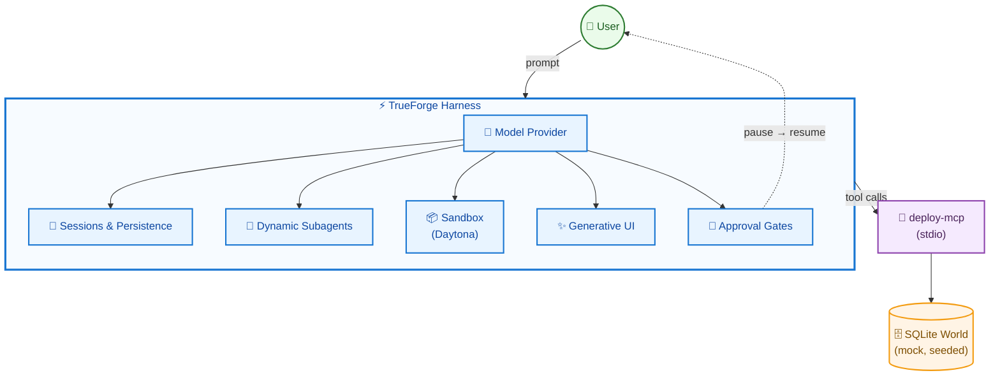
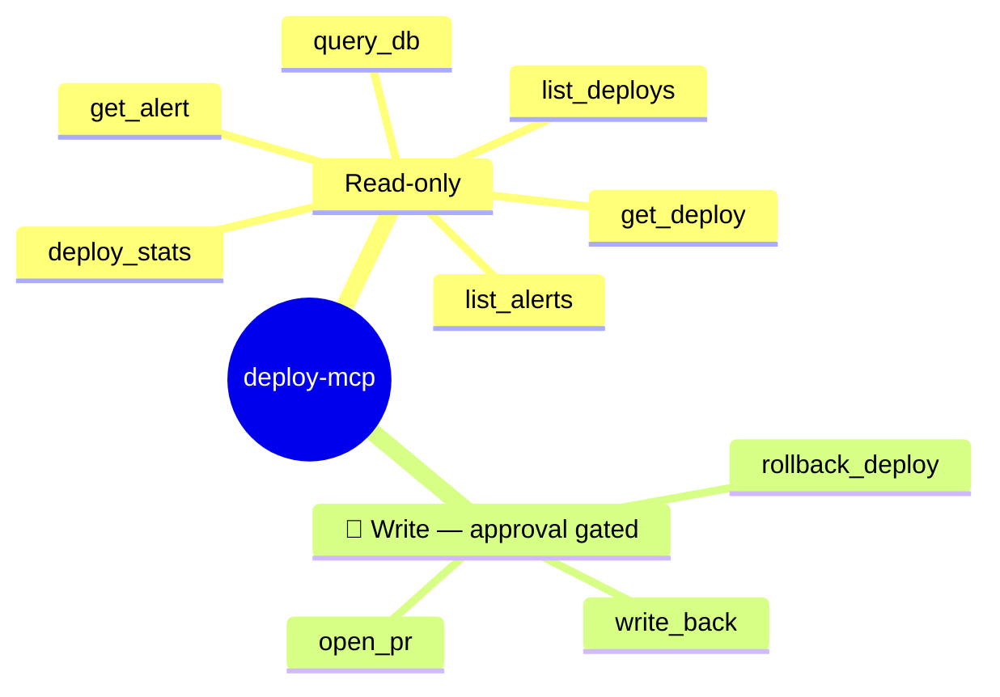
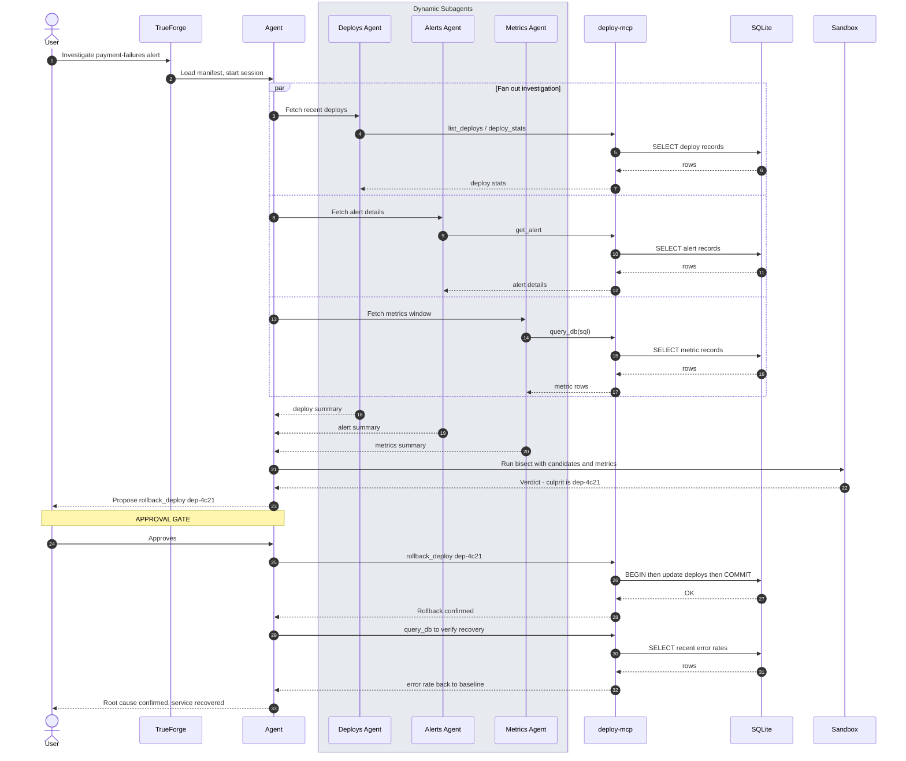
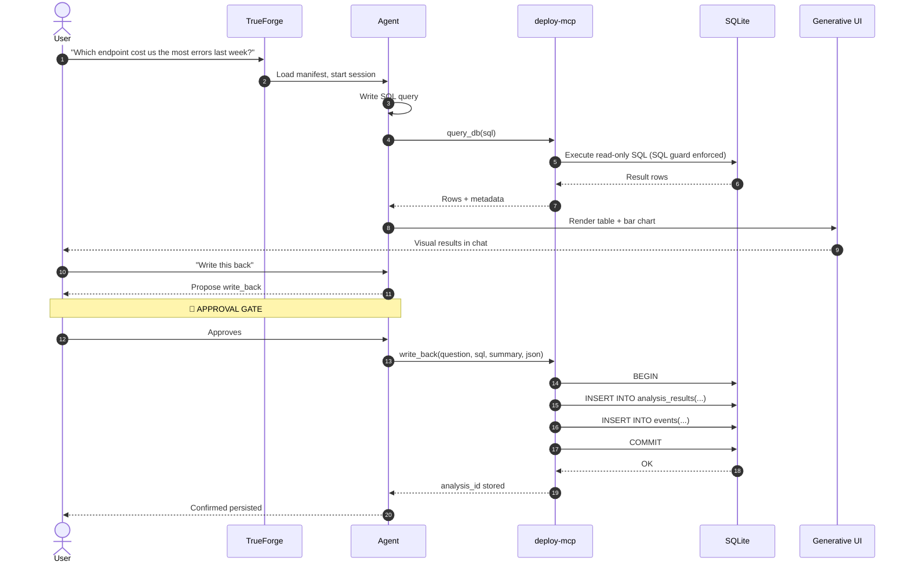

# Deploy Detective (D2)

**Incident response + analytics agent, built on the TrueForge harness.**
Investigates alerts with read-only tools, computes root cause in a sandbox, and
**stops for human approval before doing anything irreversible.**

Built for *The Agent Harness Hackathon* (WeMakeDevs × TrueFoundry × Qodo).

---

## What does your project do?

**Problem:** On-call engineers waste critical minutes manually querying deploys, alerts, and metrics to find the root cause of an incident — then must carefully roll back without breaking more. Data analysts face the same friction: write SQL, run it, verify results, then get approval before writing back or opening a PR.

**Solution:** Deploy Detective (D2) is an approval-gated agent that mirrors a real on-call engineer across two loops:

1. **Incident loop** — Given an alert, it pulls real data via MCP, fans out parallel subagents (deploys/alerts/metrics), runs a sandboxed Python bisect to compute the culprit deploy, then **pauses for human approval** before rolling back and verifying recovery.

2. **Analytics loop** — Given a plain-English question, it writes and runs SQL in the sandbox, renders a chart, then **pauses for approval** before writing results back or opening a PR.

**For:** On-call engineers, data analysts, and hackathon judges evaluating TrueForge's harness capabilities. Everything runs against a seeded, deterministic simulated world — no external accounts needed.

---

## How did you use TrueForge in your project?

TrueForge is the **runtime harness** — the agent doesn't just "call an API"; TrueForge orchestrates the entire execution loop:

| TrueForge capability | How D2 uses it |
|---|---|
| **MCP connectors** | A single custom `deploy-mcp` (stdio) server exposes all 9 tools D2 needs: `list_deploys`, `get_deploy`, `deploy_stats`, `list_alerts`, `get_alert`, `query_db` (read-only), plus `rollback_deploy`, `write_back`, `open_pr` (approval-gated writes). No external MCP servers or accounts required — even PR creation is simulated and recorded to a `pr_log` table inside the seeded world. |
| **Sandbox (Daytona)** | Agent writes and executes a Python bisect script in isolation; SQL runs in sandbox; charts rendered from real output. |
| **Subagents** | Incident investigation fans out to 3 parallel subagents (deploys, alerts, metrics); summaries merged into one timeline. |
| **Approvals** | Every write tool (`rollback_deploy`, `write_back`, `open_pr`) is gated on human approval; read-only tools run freely. |
| **Persistent sessions** | Investigation state survives page refresh/reconnect via TrueForge's session store. |
| **Generative UI** | Analytics results rendered as tables + charts in chat. |
| **Model-agnostic** | Swap providers (OpenAI, Anthropic, etc.) from UI without code changes. |

The **approval-gate pause** is the centerpiece — visible in the 3-min demo (`demo/DEMO-SCRIPT.md`).

---

## How did you use Qodo in your project?

Per hackathon requirements (FR-7), **all substantive changes flow through PRs reviewed by Qodo**:

- **Workflow:** Branch → PR → `/agentic_review` → address findings → follow-up review → merge. Direct pushes to `main` blocked.
- **Representative PR:** [#3 — deploy-mcp: implement all 9 tools with approval gating](https://github.com/amank-root/db-rag-agent/pull/3)
- **High-severity findings fixed:** SQL injection guard (`sql-guard.ts`), idempotent seed logic.
- **Medium findings resolved:** Test coverage gaps closed by adding `tools.test.ts` (42 tests now pass).
- **Evidence:** [Qodo review thread](https://github.com/amank-root/db-rag-agent/pull/3#issuecomment-xxxxx) showing findings + follow-up review pass.

Qodo caught security and correctness issues that manual review would miss, ensuring the custom MCP server and SQL guard are production-grade.

---

## Architecture

The harness sits between the user and a single MCP surface — a purpose-built `deploy-mcp` server backed entirely by the seeded, mock SQLite world. Every path that mutates state routes back through the approval gate before it reaches the user.



### MCP Tool Surface

`deploy-mcp` splits cleanly into read-only tools the agent can call freely, and write tools that are always approval-gated.



---

## Request Flow: Incident Investigation

This is the on-call path: three subagents fan out in parallel to gather deploys, alerts, and metrics, the agent runs a bisect in the sandbox to compute the culprit deploy, then stops dead at the approval gate before touching production.



---

## Request Flow: Analytics Query

This is the ad-hoc question path: the agent writes its own SQL, runs it read-only through the SQL guard, renders results with Generative UI, and only hits the approval gate when the user asks to persist the result.



---

## Quickstart (judge path)

**Prereqs:** Node ≥ 22.13.0 (24 recommended), a model-provider key, and (optionally)
a Daytona API key. Keys go **only** into TrueForge Settings — never in this repo.

```bash
# 1. Clone and build the world
git clone https://github.com/amank-root/db-rag-agent.git
cd deploy-detective
./scripts/setup.sh          # installs, compiles, seeds the deterministic world

# 2. Start the harness
npx @truefoundry/trueforge  # → http://localhost:8790

# 3. Configure the deploy-mcp connector (one-time, required)
#    Edit connectors/deploy-mcp.json and replace ${PROJECT_ROOT} with the absolute path to this checkout
#    Then in TrueForge UI: Settings → Connectors → Add connector → load connectors/deploy-mcp.json

# 4. Load the agent (one-time)
# Option A: Use the TrueForge SDK (recommended)
npm run create-agent

# Option B: Manual — in TrueForge UI:
#   Agent Library → Create Agent → load agent.json
```

No other connectors, tokens, or external accounts are needed — `deploy-mcp` is self-contained.

## Automated agent creation (TrueForge SDK)

Creates/updates the agent manifest. The `deploy-mcp` connector must still be added manually via the TrueForge UI (step 3 above).

```bash
# Requires TrueForge running at http://localhost:8790
npm run create-agent
```

## Troubleshooting

| Issue | Fix |
|---|---|
| Approval doesn't appear | Ask the agent to explicitly propose the rollback call; the gate fires on the write tool |
| Sandbox hiccup | Local fallback still runs the script; say "isolated execution" and move on |
| Anything weird | `npm run reseed`, reload, retry. The world is deterministic. |
| Qodo not responding | Verify GitHub app access on the repo; comment `/agentic_review` on PR |
| Connectors not loading | Ensure `TRUEFORGE_DATA_DIR` is set and you ran `./scripts/setup.sh` first |

## Project structure

```
.
├── agent.json                    # TrueForge agent spec (deploy-mcp only, approval-gated)
├── connectors/
│   └── deploy-mcp.json           # Custom MCP connector (stdio) - edit ${PROJECT_ROOT} before loading
├── deploy-mcp/                   # Custom MCP server (9 tools)
│   ├── src/
│   │   ├── tools/                # Tool implementations
│   │   ├── seed/                 # Deterministic world generation
│   │   └── server.ts             # MCP stdio server
│   └── package.json
├── sandbox/
│   └── bisect_template.py        # Sandbox bisect script template
├── scripts/
│   ├── setup.sh                  # One-command build + seed
│   ├── smoke.sh                  # Build + test + verify
│   └── create-agent.ts           # TrueForge SDK agent creation
├── demo/
│   └── DEMO-SCRIPT.md            # 3-min demo filming plan
└── docs/
    └── social-post.md            # Day-7 submission post
```

## License

MIT
